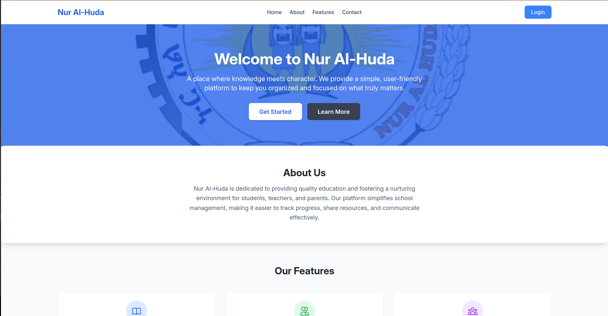
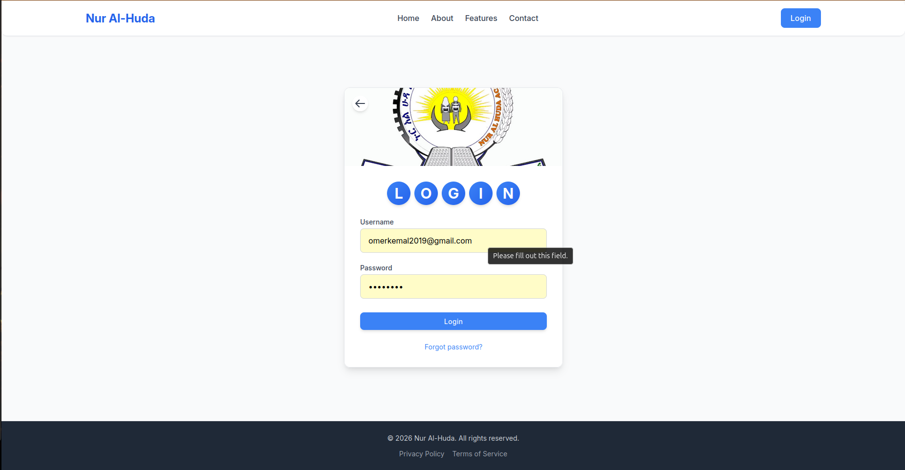
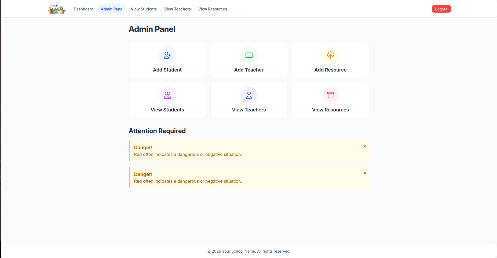
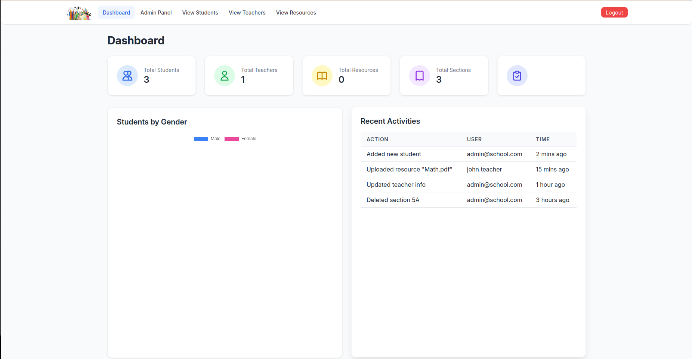

<!-- LOGO IMAGE -->
<p align="center">
  
</p>

<p align="center">
  <strong>pslms – because schools need digital chaos too</strong><br>
  <em>Primary School Learning Management System v1.0</em>
</p>

---

## ⚠️ The Usual Warning (read it or cry later)

This is a school management system. Not a C2 panel. Not a RAT.  
It's for managing students, teachers, and all the administrative chaos that comes with running a school.  
Use it for its intended purpose. Don't be an idiot.  
I'm not your lawyer, I'm not your mom, and I'm definitely not bailing you out.

You've been warned. Read it again if you need to. I'll be here. Judging you.

---

## What is this? (as if you couldn't guess)

pslms is a Flask-based school management system. Because apparently managing a school with spreadsheets wasn't painful enough.  
It handles users, events, roles, and all the other stuff that makes primary schools run (or fall apart).

Built with modular blueprints so you can pretend your code is organized.  
Supports Admin, Student, Teacher, and Public roles – because everyone needs to feel special.  
It's not magic. It's just Flask with a lot of caffeine. Calm down.

---

## Features (or "things it does when it's not crashing")

### Role-Based Access Control (because everyone needs permissions)

| Role | Access Level | Features |
|:-----|:-------------|:---------|
| **Admin** | Full System Access | Dashboard, student/teacher management, section/subject assignment – basically everything (you're welcome) |
| **Teacher** | Teaching Tools | Teacher dashboard, class management, student grading, resource sharing (for the responsible adults) |
| **Student** | Learning Portal | Student dashboard, view assignments, access learning materials (the reason this exists) |
| **Public** | Limited Access | View public pages, home, about, contact information (for the curious) |

### Core Features (the stuff that actually works)

| Feature | Description |
|:--------|:------------|
| **Modular Blueprint Architecture** | Flask blueprints because one big file is for amateurs |
| **Automated Database Setup** | Init script that does all the boring work for you (you're welcome) |
| **Cross-Platform Setup** | Works on Linux, macOS, and Windows – because diversity |
| **Event Handling System** | For notifications, errors, and telling you when you messed up |
| **Logging System** | Because you'll want to know what broke and when |
| **Excel Integration** | For exporting data and pretending you're productive |
| **User Authentication** | Secure login/logout because security is a thing (apparently) |

---

## Screenshots (because reading is hard, and you need pictures)

<div align="center">

|                         |                         |
|:-----------------------:|:-----------------------:|
|  |  |
| **Home Page**<br>Welcome to the chaos | **Login Page**<br>Enter if you dare |
|  |  |
| **Admin Panel**<br>Where the magic happens | **Dashboard**<br>Numbers that make you feel important |

</div>

*Look, pictures! Revolutionary! I know, I'm a genius.*

---

## Installation (the part you actually care about – try not to mess it up)

### Prerequisites (you need these)

- Python 3.8+ (because older versions are for dinosaurs)
- pip (obviously)
- Git (if you know how to use it – if not, Google it)

### Step-by-Step Installation (follow along, genius)

#### Step 1: Clone the repository

```bash
git clone https://github.com/omerKkemal/Work.git
cd Work
```

#### Step 2: Set up a virtual environment (because you should)

**Linux / macOS:**
```bash
python -m venv venv
source venv/bin/activate
```

**Windows:**
```bash
python -m venv venv
venv\Scripts\activate
```

#### Step 3: Install dependencies (and pray it works)

```bash
pip install -r requirements.txt
```

#### Step 4: Initialize the database (don't skip this, idiot)

```bash
bash init.sh
```

This script does everything. Because I'm nice like that.  
If you skip this, nothing will work. You've been warned.

---

## Directory Structure (the organized chaos nobody asked for)

```
Work/
│
├── app.py                          # The main event (start here)
├── init.py                         # Setup wizard (does the boring stuff)
├── init.sh                         # Cross-platform magic
├── requirements.txt                # Things you need (all of them)
│
├── admin/                          # Admin stuff (the important one)
├── student/                        # Student stuff (the reason this exists)
├── teacher/                        # Teacher stuff (for the responsible ones)
├── login/                          # Login stuff (security, apparently)
├── public/                         # Public stuff (for the curious)
├── event/                          # Event stuff (errors and notifications)
├── database/                       # Database stuff (where data goes to die)
├── utility/                        # Helper stuff (the behind-the-scenes magic)
├── data/                           # Data files (JSONs that make it work)
├── static/                         # Pretty stuff (CSS, JS, images)
├── logs/                           # Error stuff (you'll see these a lot)
├── excel/                          # Export stuff (spreadsheets for days)
└── note/                           # Optional stuff (if you're bored)
```

Yes, it's a lot of stuff. Deal with it.  
I spent like 10 minutes on this diagram. Respect the effort.

---

## Usage (the point of all this – finally)

### Starting the Application

```bash
python app.py
```

On first run, you'll be prompted to set up admin credentials and default subjects.  
Don't skip it. You'll regret it. I'm not resetting it for you.

### Accessing the Application

```
http://127.0.0.1:5000/
```

Open it in your browser. If you don't know how to do that, go back to spreadsheets.

### Default User Roles

| Role | Credentials |
|:-----|:------------|
| **Admin** | Set during initialization (write it down, genius) |
| **Teacher** | Created by admin (not your problem) |
| **Student** | Created by admin or teacher (also not your problem) |

### Available Routes (the ones you'll actually use)

| URL | Access | Description |
|:----|:-------|:------------|
| `/` | Public | Home page – the gateway to everything |
| `/about` | Public | About page – because people are curious |
| `/login` | Public | Login page – enter if you dare |
| `/admin/*` | Admin Only | Admin dashboard – where the power lies |
| `/teacher/*` | Teacher Only | Teacher dashboard – for the responsible ones |
| `/student/*` | Student Only | Student portal – the reason this exists |

---

## Tech Stack (the things that make it work – or break)

| Technology | Version | Purpose |
|:-----------|:-------:|:--------|
| Flask | 2.0+ | Web framework – the backbone (boring but reliable) |
| Python | 3.8+ | The language I pretend to know |
| SQLite | 3.x | Database – where data goes to die |
| Jinja2 | - | Template engine – makes HTML bearable |
| HTML5 | - | Frontend structure – the skeleton |
| CSS3 | - | Styling – makes it pretty (or not) |
| JavaScript | ES6 | Frontend magic – makes it interactive (sometimes) |

---

## Future Improvements (maybe someday – don't hold your breath)

| Feature | Description |
|:--------|:------------|
| **Attendance System** | Track who showed up and who didn't (the lazy ones) |
| **Gradebook** | Comprehensive grading with analytics (for the overachievers) |
| **Parent Portal** | Because parents want to know what their kids are doing (nosy) |
| **Calendar Integration** | School events without the paper calendar (so 1990s) |
| **Messaging System** | Talk to teachers without leaving the app (revolutionary) |
| **Report Cards** | Automated report generation (no more manual work, you're welcome) |
| **Mobile App** | Because everyone's on their phone anyway (including you) |
| **API Integration** | For the nerds who want to build on top (I see you) |

---

## Author (the one to blame – I know where you live)

**Omer Kemal** – Full Stack Developer, caffeine addict, and professional bug creator.

- GitHub: [@omerKkemal](https://github.com/omerKkemal)
- Website: [https://www.omerkemal.com](https://www.omerkemal.com)
- LinkedIn: [omer-kemal](https://linkedin.com/in/omer-kemal)

Found a bug? Open an issue.  
Want to improve something? Send a PR.  
Rude comments? Go touch grass.  
Actually, just go outside. It's nice out there. I promise.  
I'll be here. Alone. With my code. Crying.

---

## License

MIT License – do whatever you want. Just don't blame me when it breaks.  
If you break it, you keep both pieces. If you break the law, you keep the consequences too.

Copyright (c) 2024 Omer Kemal

---

<p align="center">
  <sub>© 2024 pslms – for learning, not for being a jerk. Seriously. Don't be a jerk. I'm watching you.</sub>
  <br>
  <sub>Go outside. Touch grass. Or don't. I'm not your mom.</sub>
</p>
